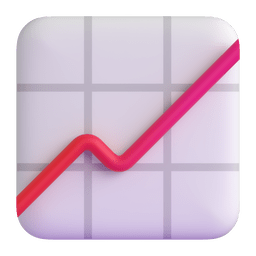

  

# Hi there! 

I'm **Ilan Fonseca**, a self-taught developer building software since 2016. I focus on backend engineering and desktop tools, primarily working with TypeScript, Java, Tauri, and Go. I like taking systems from scratch to production and keeping them fast and maintainable.

Feel free to explore my repositories below and contribute!

📫 **Contact:** [ilan-_@hotmail.com](mailto:ilan-_@hotmail.com)

##  Skills

### Languages

  

### Frameworks & Libraries

  

### Databases

  

##  GitHub Stats

  
  

